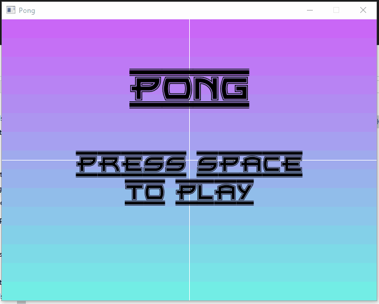

# Pong

## Summary

A Pong game written in Golang using the Ebitengine graphics library.



## Features

* Single player mode
* Basic graphics

## Installation

Make sure you have Go installed on your system. You can download it from the official [website](https://golang.org/dl/).

Clone this repository:

```shell
git clone https://github.com/KalebHawkins/pong.git
cd pong.git
```

Install dependencies:

```shell
go mod tidy
```

## Running the Game

Navigate to the project directory in your terminal.
Build the executable:

```shell
go build . -o pong
```

Run the game:

```shell
./pong
```

## Controls

**Movement:** `W` and `S` keys to move the paddle.
**Pause:** `Escape`, `Space`
**Unpause:** `Escape`, `Space`

Contributing

We welcome contributions to this project! If you have any bug fixes or improvements, feel free to submit a pull request.

License

This project is licensed under the MIT License. See the LICENSE file for details.