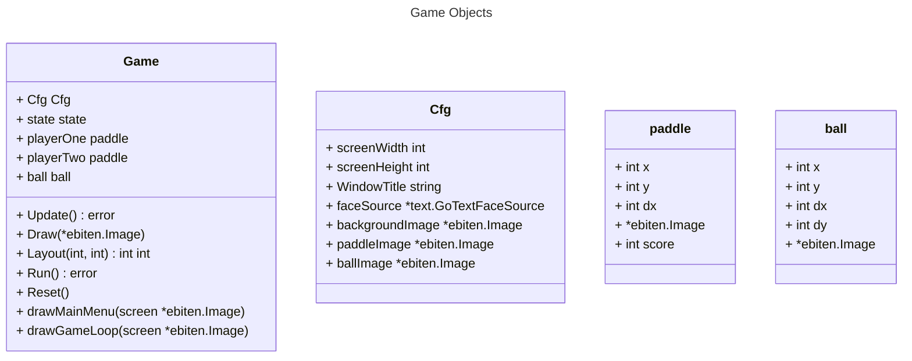

```mermaid
---
title: Game Objects
---
classDiagram
    class Game {
        + Cfg Cfg

        + state state
        + playerOne paddle
        + playerTwo paddle
        + ball ball


        + Update() error
        + Draw(*ebiten.Image)
        + Layout(int, int) int int
        + Run() error
        + Reset()
        + drawMainMenu(screen *ebiten.Image)
        + drawGameLoop(screen *ebiten.Image)
    }

    class Cfg {
        + screenWidth int
        + screenHeight int
        + WindowTitle string
        + faceSource *text.GoTextFaceSource
        + backgroundImage *ebiten.Image
        + paddleImage *ebiten.Image
        + ballImage *ebiten.Image
    }

    class paddle {
        + int x
        + int y
        + int dx
        + *ebiten.Image
        + int score
    }

    class ball {
        + int x
        + int y
        + int dx
        + int dy
        + *ebiten.Image
    }

```